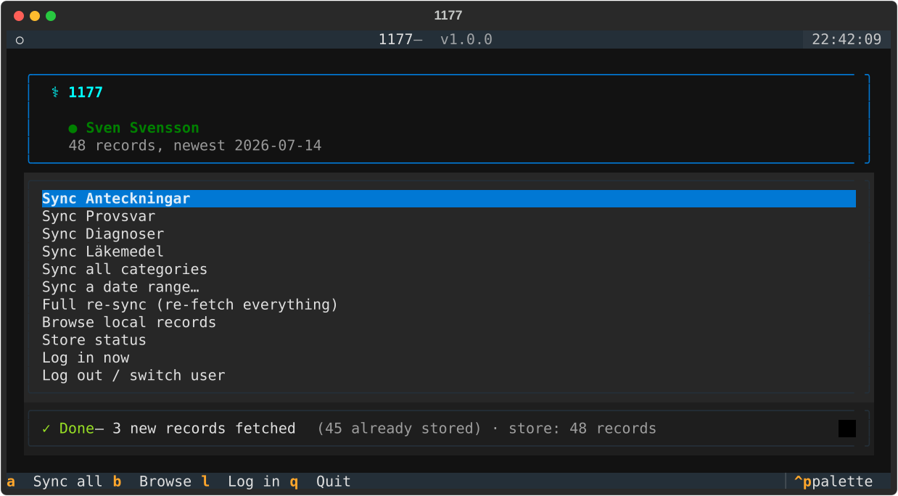

# 1177

Your Swedish medical journal, in your terminal.

Your medical records live on [journalen.1177.se](https://journalen.1177.se),
behind a login, one page at a time. This is a small terminal app that gets
you a local copy: log in with BankID (the QR code renders in your shell),
sync to Markdown + JSON, browse from the terminal.

Local files are the point. Grep years of records, diff what changed after a
visit, run your own analysis — or point an agent at them to help decode what
the doctor actually wrote (`AGENTS.md` shows it the ropes). Especially
useful during ongoing care, when new notes and results land every week.



Sync is incremental — run it whenever, it only fetches what's new. Log in
and your records load; log out (`o`) and someone else can log in with their
BankID — every identity gets its own folder, so family members never mix.

## You need

- Python 3.10+ and [uv](https://docs.astral.sh/uv/)
- A Swedish BankID (on your phone or this computer)

## Install

```bash
git clone <repo-url> && cd 1177-cli
uv tool install .
"$(uv tool dir)/1177/bin/playwright" install chromium
```

## Run

```bash
1177
```

That's the whole thing. The app opens, you pick an action, scan the QR with
BankID when asked. Records land in `~/.1177/<you>/` as per-date
Markdown files plus one `journal.json` — one folder per BankID identity,
picked automatically when you log in.

For scripts and cron there's a flag for everything — `1177 --help`. The
useful ones:

```bash
1177 --sync                    # one incremental sync, no UI
1177 --sync --category all     # all four record categories
1177 --since 2026-01-01        # date-bounded
1177 --auth app                # BankID popup on this Mac instead of QR
1177 --auth window             # visible browser, when all else fails
```

## Worth knowing

- **It's your medical data.** Everything is stored locally in `~/.1177/` in
  your home directory (one subfolder per BankID identity); nothing is sent
  anywhere. Treat that directory like the sensitive thing it is — and point
  `--output-dir` somewhere else if you'd rather keep it, say, on an encrypted
  volume.
- Unofficial hobby tool — not affiliated with 1177, Inera, or BankID. It
  automates what you'd do by hand in a browser, on your own journal. The
  site changes, things break, PRs welcome.
- Built with [tyro](https://github.com/brentyi/tyro),
  [Textual](https://textual.textualize.io/) and Playwright. One Python file,
  on purpose. Dev and agent notes in `AGENTS.md`.

MIT.

Made with ❤️ from the patient side of Karolinska sjukhuset — tack, vården.
If it made your care easier to follow, [buy me a coffee](https://buymeacoffee.com/frosteryd).
